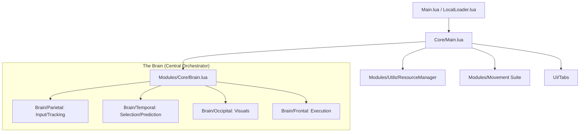

# Project Context: Star Glitcher ~ Revitalized

This document serves as the "Central Knowledge Base" for the Star Glitcher project, detailing its architecture, core systems, and overlapping relationships.

## 🏗️ Architecture Overview

The project uses a **Modular Orchestration** pattern. It is designed to be highly decoupled, using a custom `ResourceManager` to handle dependency injection and lazy loading.

### 🧩 Core Components Hierarchy

---

## 🧠 The Brain (& Overlapping Relationships)

The `Brain.lua` acts as the "Spinal Cord," connecting specialized "lobes" to coordinate combat logic.

| Lobe | Responsibility | Dependencies / Overlaps |
| :--- | :--- | :--- |
| **Parietal** | Input Handling & Entity Tracking | `InputHandler`, `NPCTracker` |
| **Temporal** | Target Selection & Kalman Prediction | `TargetSelector`, `Predictor`, `Kalman` |
| **Occipital** | Visual Rendering | `FOVCircle`, `Highlight`, `TargetDot` |
| **Frontal** | Combat Execution | `Aimbot`, `SilentAim`, `SilentResolver` |

### 🛠️ Key Interaction Flows

- **Combat Loop**: `RunService.Heartbeat` triggers `Brain:Scan()` (75Hz-120Hz), trong khi `RenderStepped` kích hoạt `Brain:Update()` để đồng bộ hóa hình ảnh/ngắm.
- **Data Flow**: `Data/Config.lua` (Options) là nguồn sự thật duy nhất. Hầu hết các module được khởi tạo với bảng `Options`.
- **Movement Synchronization**: `MovementArbiter` đảm bảo các mod di chuyển (Noclip, Speed, Gravity) không xung đột hoặc gây "rubber-banding".

---

## 🛠️ Detailed Technical Breakdown

### 1. Combat & Prediction (The "Temporal" & "Frontal" Lobes)

- **Adaptive Kalman Filter**: Sử dụng bộ lọc Kalman 1D để giảm nhiễu chuyển động. Tham số nhiễu (Q và R) được điều chỉnh động dựa trên "Confidence" và "Shock" (tốc độ thay đổi đột ngột) để cân bằng giữa độ mượt và độ bám.
- **State Isolation**: Mỗi mục tiêu có một Estimator và Stabilizer riêng biệt được lưu trữ trong `weak table` (`__mode = "k"`). Kỹ thuật này giúp tránh rò rỉ bộ nhớ và ngăn chặn dữ liệu cũ ảnh hưởng đến mục tiêu mới.
- **Layered Prediction**: Chia dự đoán thành 4 lớp độc lập: `Sampler` (lấy mẫu), `Estimator` (ước lượng vận tốc), `Engine` (tính toán quỹ đạo), và `Stabilizer` (làm mượt kết quả).

### 2. Entity Management (NPCTracker)

- **Folder-First Discovery**: Ưu tiên quét các thư mục thực thể cụ thể (`Entities`, `Enemies`) thay vì quét toàn bộ Workspace. Tránh sử dụng `GetDescendants()` để bảo vệ hiệu năng FPS.
- **Universal Targeting**: Hỗ trợ cả `Humanoid` và `Non-Humanoid` (Boss tùy chỉnh) bằng cách nhận diện các chỉ số máu và `PrimaryPart` thay thế.
- **Task Queued Scans**: Sử dụng một `TaskScheduler` để xếp hàng các công việc nặng như quét thực thể lỗi thời (stale sweep) hoặc làm mới danh sách thư mục (folder refresh), tránh gây đứng hình (frame spikes).
- **Polling Strategy**: Giới hạn tần suất quét thực thể ở mức 100ms (`0.1s`), tách biệt hoàn toàn với tốc độ khung hình của game.

### 3. Movement & Bypasses

- **Metamethod Hooking**: Sử dụng `hookmetamethod(game, "__index", ...)` để chặn các truy cập từ script của game vào thuộc tính `WalkSpeed` và `JumpPower` của nhân vật.
- **Context-Aware Spoofing**: Sử dụng `checkcaller()` để trả về giá trị mặc định cho game trong khi cho phép script hack sử dụng giá trị thực tế cao hơn.
- **Physics State Hijacking**: Can thiệp vào trạng thái vật lý của nhân vật thông qua `Stepped` kết hợp với `MovementArbiter` để duy trì sự ổn định khi bay hoặc đi xuyên tường.

### 4. Resource Management & Loader

- **3-Tier Resource Loading**:
  1. **Local Override**: Ưu tiên đọc file từ ổ cứng cục bộ khi phát triển.
  2. **Disk Cache**: Lưu trữ tệp đã tải vào thư mục ẩn `.star_glitcher_cache/`.
  3. **Remote Fetch**: Tải từ GitHub với cơ chế thử lại (3 lần) và chèn metadata phiên bản.
- **Managed Cleanup**: Sử dụng hệ thống theo dõi đối tượng (Object Tracking) để đảm bảo mọi `Connection` và `Instance` đều được dọn dẹp sạch sẽ khi script tắt (Nuclear Flush).

### 5. Core Orchestration

- **EMA (Exponential Moving Average)**: Tính toán DeltaTime trung bình để ổn định tần suất quét của Brain, bất kể FPS của game biến động như thế nào.
- **Hertz Normalization**: Giới hạn logic Brain ở mức 75Hz-120Hz (tùy cấu hình) để đảm bảo CPU không bao giờ quá tải.

---

## 🎯 Current Focus & Constraints

- **Performance**: Quy trình quét được giới hạn để duy trì CPU ở mức cực thấp (<1%).
- **Accuracy**: Độ chính xác cao nhờ bộ lọc Kalman và bù trễ (latency compensation).
- **Safety**: Đa lớp bảo vệ (`RejoinOnKick`, `AttributeCleaner`, `SpeedSpoof`) giúp giảm thiểu rủi ro bị ban.
